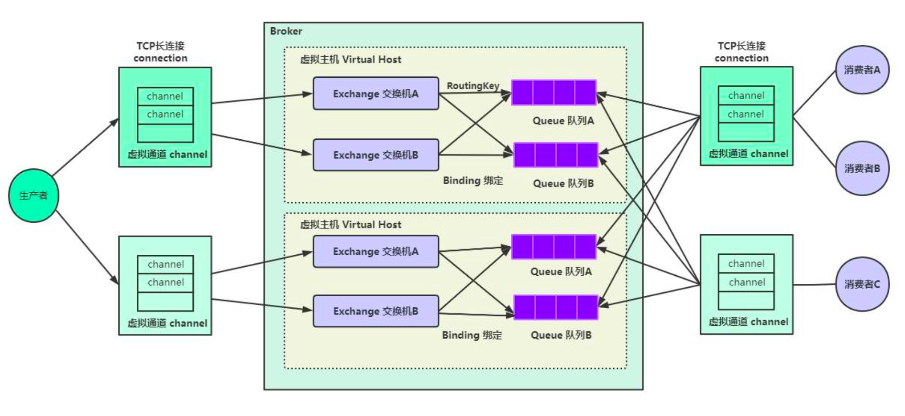
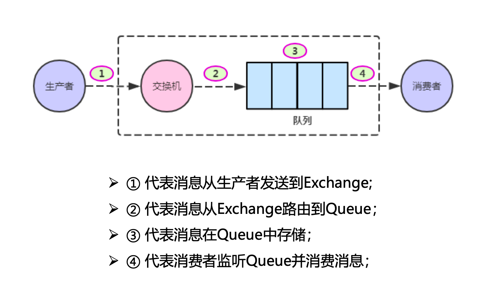
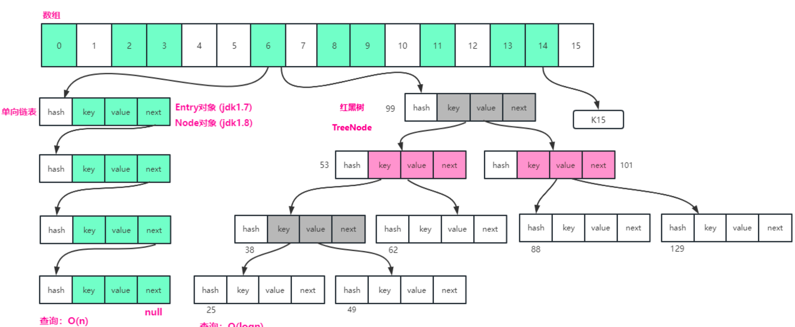

## Redis

Redis应用场景：

1. 缓存：热点数据（经常查询，但不修改或删除数据）首选Redis缓存，性能优秀；

2. 分布式锁：锁，即在多线程环境下，对共享资源的访问造成的线程安全问题，通过锁的机制来实

   现资源访问互斥；比如Java语言有线程锁：synchronize / Lock 等；

```
分布式锁:
1、获取锁：setnx key value
2、设置锁过期时间：expire key 30
3、执行业务代码
4、释放锁：del key

Redisson实现分布式锁：
➢ 1、获取锁：redisson.getLock("lock");
➢ lock.lock(); 自动设置锁有效期30s，并且采用看门狗机制，10s卡现场
➢ 2、执行业务代码
➢ 3、释放锁：lock.unlock();
```

3. 采用Redis缓存，遇到缓存穿透、缓存击穿、缓存雪崩怎么办？

（1）缓存穿透：是由于 **请求一个不存在的数据** 而导致的。【缓存空结果，对数据库查询不存在的数据仍然缓存到缓存中，比如缓存一条

空值 unknow，这样有效减少查询数据库的次数】

（2）缓存击穿：高并发条件下，对于热点数据（一般地，80%的情况下都是访问某些热点数据，也就是访问某些热点key，其他key访问会比较少），当数据失效的一瞬间，或者刚开始时缓存中还**没有对热点数据进行缓存**，所有请求都被发送到数据库去查询，数据库被压垮；【全局锁，在访问数据库之前都先请求全局锁，获得锁的线程才有资格去访问数据库，其他线程必须等待。】

（3）缓存雪崩：大量的key或者整个缓存的数据全部过期了，然后瞬间所有的请求都落到数据库，数据库被压垮；【给不同的key设置不同的过期时间；】

4. 如何保证数据库与Redis的数据一致性？

即在数据库发生增删改的时候，数据库的数据要和Redis缓存的数据保持一致性；

```
1. 延迟双删策略（推荐）
原理：
先删除 Redis（保证缓存不影响数据库更新）。
更新数据库。
再延迟删除 Redis（防止并发请求导致的缓存污染）。
// 第一次删除 Redis
redis.del(key);

// 更新数据库
update database set value = xxx where id = xxx;

// 休眠一段时间（保证业务逻辑执行完毕）
Thread.sleep(500);

// 再次删除 Redis
redis.del(key);

2.更新数据库时同步更新 Redis
原理：
事务中同时更新数据库和 Redis。
事务提交成功后，保证数据库和缓存数据一致。
try {
    transaction.begin();

    // 更新数据库
    update database set value = xxx where id = xxx;

    // 更新 Redis
    redis.set(key, value);

    transaction.commit();
} catch (Exception e) {
    transaction.rollback();
}

```


## Spring

1. 我看你项目中都是基于Spring开发的，Spring容器中的Bean是线程安全的吗？

**默认情况下，Spring Bean 是单例（Singleton）作用域**，线程不安全，可以使用 `@Scope("prototype")`（多实例模式）来解决

2. 什么情况下会触发Spring事务回滚？如果事务方法抛出IOException是否会触发Spring事务回滚？

Spring **默认** 只有当 **运行时异常（`RuntimeException`）或 `Error`** 抛出时，才会触发事务回滚。

Spring 事务的回滚策略如下：

- 回滚（Rollback）：
  - 抛出 `RuntimeException`（如 `NullPointerException`, `IllegalArgumentException`）。
  - 抛出 `Error`（如 `OutOfMemoryError`, `StackOverflowError`）。
- 不会回滚（No Rollback）：
  - 抛出 **`CheckedException`**（如 `IOException`, `SQLException`）。
  - 没有抛出异常但逻辑错误（不会自动回滚）。

可以try catch 后，手动标记事务回滚或者 抛出`RuntimeException`来让`IOException`异常回滚，或者@Transactional(rollbackFor = Exception.class)。

3. 有没有遇到过Spring事务失效的情况，什么情况下Spring事务会失效呢？

```
1. @Transactional 方法被内部调用（this.方法()）:Spring 事务是通过 AOP 代理（JDK动态代理或CGLIB） 实现的，只有外部调用 时，Spring 才能拦截并管理事务。【如果在同一个类的 内部方法调用，不会经过 AOP 代理，事务就会失效。】

2. @Transactional 方法不是 public：Spring 事务 只能应用于 public 方法，private 或 protected 方法事务不会生效。【还包括final 或 static 方法】

3. 事务方法被 try-catch 捕获异常：Spring 事务的回滚依赖于异常的传播，如果 try-catch 捕获了异常，Spring 就不会检测到异常，事务不会回滚。

```

4. 对Spring框架Bean的生命周期有了解过吗？

```
Spring Bean 生命周期主要分为以下 7 个阶段：

1. Bean 实例化（Instantiation）
通过 @Component、@Bean 或 XML 配置，Spring 解析 Bean 定义，并创建对象实例（默认调用无参构造方法）。
这一步 Bean 只是被创建，还未初始化属性。

2. 依赖注入（Populate Properties）
Spring 解析 @Autowired、@Value、@Resource 等注解，为 Bean 注入依赖（赋值）。
这一步完成后，Bean 的所有属性都已经赋值完毕。
3. BeanNameAware 回调
如果 Bean 实现了 BeanNameAware 接口，Spring 会调用 setBeanName(String name) 方法，传入 Bean 的名字。
4. BeanFactoryAware、ApplicationContextAware 等回调
如果 Bean 实现了 BeanFactoryAware 或 ApplicationContextAware，Spring 会调用相应方法，传入 BeanFactory 或 ApplicationContext，让 Bean 拿到 Spring 容器。
5. InitializingBean 和 @PostConstruct（初始化回调）
如果 Bean 实现了 InitializingBean，Spring 会调用 afterPropertiesSet() 方法进行初始化。
如果 Bean 上有 @PostConstruct 注解，Spring 也会执行这个方法。
如果 @Bean(initMethod = "xxx") 指定了方法，Spring 也会执行该方法。
6. Bean 进入就绪状态（Ready）
经过初始化后，Bean 进入就绪状态，可以被应用程序使用。
7. DisposableBean、@PreDestroy 和 destroyMethod（销毁回调）
如果 Bean 实现了 DisposableBean，Spring 会调用 destroy() 方法。
如果 Bean 上有 @PreDestroy 注解，Spring 也会执行这个方法。
如果 @Bean(destroyMethod = "xxx") 指定了方法，Spring 也会执行该方法。

1. [实例化] 调用构造方法
2. [BeanNameAware] 获取 Bean 名称：myBean
3. [BeanFactoryAware] 获取 BeanFactory
4. [ApplicationContextAware] 获取 ApplicationContext
5. [@PostConstruct] 初始化方法
6. [InitializingBean] afterPropertiesSet 初始化
---- Bean 就绪，开始使用 ----
7. [@PreDestroy] 销毁方法
8. [DisposableBean] destroy 销毁

```


5. 什么是 IOC（控制反转）？

**IOC（Inversion of Control，控制反转）** 是一种设计模式，主要用于**将对象的创建和管理交给 Spring 容器，而不是手动 new**。Spring 通过**IOC 容器**管理 Bean，自动创建对象，并进行**依赖注入**`@Autowired`。

Spring 通过 IOC 容器**创建、管理和注入 Bean**，解耦对象之间的依赖。


6. AOP（面向切面编程）

AOP（Aspect-Oriented Programming，**面向切面编程**）是对 OOP（面向对象编程）的补充，**主要用于抽离通用功能（如日志、事务、权限校验）**，避免代码重复。


7. 请说一说Spring Boot的自动装配原理？


8. SpringBoot默认是使用JDK动态代理还是CGLIB动态代理？为什么？

**Spring Boot 1.x：** 默认使用 JDK 动态代理。

**Spring Boot 2.x：** 默认使用 CGLIB 动态代理，即使目标对象实现了接口。

**JDK 动态代理 vs CGLIB 动态代理**

- **JDK 动态代理**：
  - 依赖于接口（Interface）进行代理。
  - 只要目标对象实现了接口，Spring 就会使用 JDK 动态代理来创建代理对象。
  - **优点**：JDK 动态代理性能较好，因为它是基于接口的，生成的代理类非常轻量。
  - **缺点**：只能代理实现了接口的类，不能代理没有实现接口的类。
- **CGLIB 动态代理**：
  - 通过子类化目标类来创建代理对象。
  - 可以代理没有实现接口的类，因为它是通过继承目标类来创建代理对象。
  - **优点**：支持没有实现接口的类。
  - **缺点**：生成的代理类是目标类的子类，可能会引入额外的性能开销，且如果目标类有 `final` 方法（例如 `final` 类或 `final` 方法），CGLIB 无法代理。


## RabbitMQ



1. RabbitMQ 核心组件
   RabbitMQ 由以下 6 个核心组件 组成：

**Producer（生产者）**
负责发送消息到 RabbitMQ 交换机（Exchange）。 生产者不会直接发送到队列，而是先发送到交换机。
**Exchange（交换机）**
负责接收生产者的消息，并根据路由规则转发到队列。
交换机类型（4 种）：

- Direct（直连交换机）：根据路由键精确匹配进行路由消息队列, 按Routing Key 精确匹配转发消息。
- Fanout（广播交换机）：投递到所有绑定的队列，不需要规则，不需要匹配，相当于广播、群发；（忽略 Routing Key）。
- Topic（主题交换机）：支持模糊匹配（* 匹配一个单词，# 匹配多个单词）。
- Headers（头交换机）：按消息头属性匹配转发（不使用 Routing Key）。

**Queue（队列）**
存储消费者未消费的消息，防止数据丢失。
RabbitMQ 采用 FIFO（先进先出） 规则，先到的消息先消费。
**Routing Key（路由键）**
用于绑定交换机和队列，决定消息流向。
Direct 交换机 需要 Routing Key 完全匹配 才能路由消息。
**Consumer（消费者）**
监听队列，获取消息并进行消费。
可以主动拉取消息（Pull）或被动接收消息（Push）。
支持多消费者并发消费，提高处理能力。
**Binding（绑定）**
交换机和队列的关系，定义消息如何路由。
绑定时需要指定 Routing Key，只有符合条件的消息才能到达队列。

| **组件**        | **作用**               |
| --------------- | ---------------------- |
| **Producer**    | 生产者，发送消息       |
| **Exchange**    | 交换机，路由消息到队列 |
| **Queue**       | 队列，存储消息         |
| **Consumer**    | 消费者，消费消息       |
| **Routing Key** | 交换机到队列的路由规则 |
| **Binding**     | 绑定队列与交换机       |



RabbitMQ如何保证消息的幂等性？

RabbitMQ **可能会导致重复消费**，原因如下：

1. 生产者重复发送：
   - 生产者发送消息后，如果网络故障导致 RabbitMQ **没有返回 ACK**，生产者可能会**重试发送**，导致消息重复。
2. 消费者重复消费：
   - RabbitMQ **默认是消息确认机制（ACK 机制）**，如果**消费者在处理消息后宕机**，RabbitMQ **检测不到 ACK**，会重新投递消息，导致**重复消费**。

保证MQ的幂等性，只要保证消费者不会重复消费相同的消息即可: 

➢ 生产者发送消息时，为每条消息设置一个全局唯一的id；

➢ 消费者消费消息时，使用redis的setnx命令：SET id 1 NX，若返回OK，说明该消息之前没有消费过，正常消费；若返回nil，说明该消息之前已消费过，那就不用处理；


什么是死信队列？死信队列是如何导致的？

**死信队列（Dead Letter Queue, DLQ）** 是指**无法被正常消费的消息会被重新路由到特殊的交换机（DLX），然后进入死信队列（DLQ）**，方便后续分析和处理。

在 RabbitMQ 中，**当消息变成 "死信" 后，RabbitMQ 会将消息转发到死信交换机（DLX），并存入死信队列**，而不是直接丢弃消息。

RabbitMQ 消息**变成死信**的**三种常见情况**：

| **原因**                                           | **触发条件**                         | **示例**                                        |
| -------------------------------------------------- | ------------------------------------ | ----------------------------------------------- |
| **① 队列长度限制（队列满了）**                     | 队列达到了最大长度（`x-max-length`） | 订单队列**限制 1000 条**，超出时新消息变成死信  |
| **② 消息超时未消费（TTL 过期）**                   | 消息存活时间（`TTL`）到期仍未被消费  | **未支付订单**，30 分钟后自动进入死信队列       |
| **③ 消费失败 + `reject`/`nack` + `requeue=false`** | 消费者拒绝消息，并且 **不重新入队**  | 消费者**处理失败**，手动 `basicNack()` **丢弃** |

**死信队列常用于**：

- **订单超时自动取消**。
- **防止消息丢失，方便排查问题**。
- **实现延迟消息队列（基于 TTL 机制）**。


什么是延迟队列？RabbitMQ 如何实现延迟队列？

**延迟队列（Delayed Queue）** 是指**消息在指定时间后才能被消费**，而不是立即投递到消费者。它常用于：

- **订单超时**（未支付订单 30 分钟后自动取消）。
- **定时任务**（10 分钟后发送提醒短信）。
- **重试机制**（任务失败后，5 分钟后重新执行）。

RabbitMQ **本身不支持延迟队列**，但可以通过以下 **两种方式** 实现：

| **方案**                                                 | **核心原理**                                      | **优点**                     | **缺点**                   |
| -------------------------------------------------------- | ------------------------------------------------- | ---------------------------- | -------------------------- |
| **① 基于 TTL + 死信队列（推荐）**                        | 设置消息存活时间（TTL），到期后转入死信队列再消费 | 简单易用，性能高             | **只能保证固定时间后投递** |
| **② 基于 RabbitMQ 官方插件（Delayed Message Exchange）** | 使用 RabbitMQ 官方 `x-delayed-message` 插件       | 支持**任意延迟时间**，更灵活 | 需要**安装插件**，配置复杂 |


RabbitMQ的高可用机制有了解嘛？

RabbitMQ 作为**分布式消息队列**，提供了**多种高可用机制**，确保在**节点宕机、网络故障**等情况下，消息不会丢失，服务可持续运行。

| **方案**                                   | **核心原理**                                         | **优点**               | **缺点**                   |
| ------------------------------------------ | ---------------------------------------------------- | ---------------------- | -------------------------- |
| **单节点模式（Standalone）**               | 单机运行 RabbitMQ                                    | 简单，适合测试环境     | **单点故障，宕机后不可用** |
| **普通集群模式（Cluster）**                | **多个节点**，但队列消息**仅存储在主节点**           | 负载均衡，扩展性好     | **主节点宕机，消息丢失**   |
| **镜像队列模式（HA - High Availability）** | **队列数据同步到多个节点**，主节点宕机后**自动切换** | **高可用，数据不丢失** | 性能比普通集群模式略低     |

**镜像队列模式**（Mirrored Queue）是 RabbitMQ **核心的高可用方案**，它的工作方式如下：

- **队列主节点（Master）** 负责接收和分发消息。
- **队列副本（Mirror）** 存储在**其他节点**，**实时同步主节点数据**。
- **主节点宕机**后，RabbitMQ **自动选举新主节点**，保证消息可用。


如果有百万消息堆积在MQ中，如何解决？

**🔥 1️⃣ 加快消费速度**

- **增加消费者数量**（扩容线程 & 多机器消费）。
- **批量消费消息**（减少 RabbitMQ 通信成本）。
- **设置 `Prefetch` 机制**（让消费者一次拿多个消息）。

**🔥 2️⃣ 限制 RabbitMQ 队列压力**

- **限制队列长度**（`x-max-length`）。
- **设置消息 TTL**（过期自动删除）。
- **死信队列（DLX）**（防止堆积导致 RabbitMQ 崩溃）。

**🔥 3️⃣ 降低 RabbitMQ 存储压力**

- **RabbitMQ 只存储消息 ID，完整数据放 Redis / MySQL**。
- **如果消息量极大，改用 Kafka 处理高并发流式消息**。


如何解决RabbitMQ中因为消息堆积而导致的消息过期失效的问题？

当 **RabbitMQ 消息大量堆积**，可能导致**消息超时（TTL 过期）或队列满溢**，最终导致：

- **消息被丢弃**（TTL 过期后直接删除）。
- **进入死信队列（DLX）**，但仍然影响业务处理时效性。

要**避免消息过期丢失**，可以采取**加快消费 + 延长消息生命周期 + 降低 RabbitMQ 负担**等策略。


RabbitMQ **消息堆积导致过期失效**，本质上是**消费者消费不过来**，所以核心策略是：

**🔥 1️⃣ 加快消费**

✅ **增加消费者线程**（并行处理）。
✅ **多实例消费（多台服务器一起消费）**。
✅ **开启 `Prefetch`，批量消费消息**。

**🔥 2️⃣ 延长消息生命周期**

✅ **延长 TTL 时间，避免过期**。
✅ **结合死信队列（DLX），存储过期消息，等待后续处理**。

**🔥 3️⃣ 降低 RabbitMQ 负担**

✅ **RabbitMQ 只存消息 ID，完整数据存 Redis**。
✅ **如果消息量特别大，改用 Kafka**。


## 多线程

1. Java线程池有哪些核心参数，分别有什么的作用？

2. 线程池有哪些拒绝策略？

**默认策略是 `AbortPolicy`**（直接抛异常），适用于**必须保证任务执行**的场景。

**如果允许任务丢失**，可选择 `DiscardPolicy` 或 `DiscardOldestPolicy`。

**如果希望尽可能执行任务**，`CallerRunsPolicy` **让主线程执行任务**，防止任务丢失，但可能影响主线程性能。

**对于高可靠性场景**，可使用 **自定义拒绝策略**（如**日志记录、重试、存入消息队列**）。

3. 说一说线程池的执行流程?


4. 请说说sleep()和wait()有什么区别？

✅ `sleep()` **让线程暂停一段时间**，**不会释放锁**，时间到后自动恢复
✅ `wait()` **让线程进入等待状态**，**会释放锁**，必须用 `notify()` 唤醒


5. Java线程池中submit()和execute()方法有什么区别？

| **对比项**           | **execute()**                      | **submit()**                                     |
| -------------------- | ---------------------------------- | ------------------------------------------------ |
| **返回值**           | `void`（不返回结果）               | `Future<?>`（可获取结果或异常）                  |
| **异常处理**         | **异常会直接抛出，导致线程池终止** | **异常不会直接抛出，可通过 `Future.get()` 获取** |
| **适用于**           | 仅执行任务，不关心返回值           | 需要获取执行结果、处理异常或取消任务             |
| **Callable 支持**    | ❌ 仅支持 `Runnable`                | ✅ 支持 `Runnable` 和 `Callable`                  |
| **获取任务执行状态** | ❌ 无法跟踪                         | ✅ 可用 `Future` 追踪状态                         |


## Mybatis

1. 说一说MyBatis框架里面的缓存机制是怎么回事？

➢ 一级缓存是SqlSession级别的缓存， 通过同一个SqlSession查询的数据会被缓存，下次查询相同的数据，就会从缓存中直接获取，不会再从数据库查询；

➢ 一级缓存是默认开启的，是不能关闭的，但可以调用SqlSession的clearCache()方法清理缓存；

➢ 不同SqlSession之间的缓存数据是隔离的，即一个SqlSession中的缓存数据在另一个SqlSession中是读取不到的；

➢ 二级缓存默认是关闭的，开启二级缓存，需要同时有如下两项：Mapper.xml <cache/>

➢ 二级缓存是跨SqlSession的，多个SqlSession可以共用同一个二级缓存；

➢ 二级缓存是mapper级别的缓存，根据mapper的namespace区分，两个mapper的namespace相同，则这两个mapper执行sql查询到的数据将缓存到相同的二级缓存区域中；

➢ 使用二级缓存的POJO类要实现Serializable接口；

## 集合

1. 有没有了解过HashMap底层是怎么实现的？

在JDK1.7中，由 数组+链表 构成；

在JDK1.8中，由 数组+链表+红黑树 构成；

➢ (1) 数据以键值（key-value）对方式存储的一个集合容器；

➢ (2) Key不重复；

➢ (3) 可以使用null的键和null的值；

➢ (4) 不保证key-value映射的顺序；

➢ (5) 非线程安全实现的；



➢ （1）初始容量capacity：创建数组的长度默认是16，如果太少，很容易触发扩容，如果太多，遍历数组会比较慢；

➢ （2）负载因子loadFactor：一个衡量的尺度，数组长度达到多少的时候触发数组自动扩容，默认为0.75；

➢ （3）阈值threshold：阈值=容量*负载因子，默认16*0.75=12，当元素数量超过阈值时触发扩容；


## JAVA基础

1. Java继承时父子类的初始化顺序是怎样的？

当创建子类对象时，**父类先初始化，然后才初始化子类**，具体顺序如下：

1️⃣ **父类的静态变量 & 静态代码块**（按顺序执行）  

2️⃣ **子类的静态变量 & 静态代码块**（按顺序执行）

3️⃣ **父类的实例变量 & 普通代码块**（按顺序执行）  

4️⃣ **父类的构造方法**

5️⃣ **子类的实例变量 & 普通代码块**（按顺序执行）

6️⃣ **子类的构造方法**


## JVM

1. 你了解JVM类加载的双亲委派模型吗？

在 Java 中，**类加载采用“双亲委派模型”**，其核心思想是：
 **“一个类加载器在加载类时，先把请求交给父加载器，如果父加载器找不到该类，才由当前加载器自己加载。”**

类加载请求的流程如下：

- **当前类加载器** 先将加载请求交给 **父类加载器** 处理。
- **如果父类加载器能够加载**，则直接返回。
- **如果父类加载器找不到该类**，则当前类加载器尝试自己加载该类。

**双亲委派模型：**

- 先让 **父类加载器** 处理，找不到才让 **当前类加载器** 处理，保证安全性。

**类加载器的层次结构：**

- `Bootstrap ClassLoader` → `Extension ClassLoader` → `Application ClassLoader` → `Custom ClassLoader`


## MySQL

1. MySQL支持哪些存储引擎？

**1️⃣ InnoDB（默认 & 推荐）**

✅ **特点：**

- **支持事务（ACID）**：使用 **MVCC**（多版本并发控制）和 **行级锁**。
- **支持外键**（FOREIGN KEY）。
- **支持自动崩溃恢复**。
- **采用聚簇索引**，主键查询性能较高。
- **默认存储引擎**（MySQL 5.5+）。

2. MySQL如何定位慢查询？

`EXPLAIN` 可以帮助分析 SQL 的执行过程，优化查询。

```
EXPLAIN SELECT * FROM orders WHERE user_id = 1001;
```

type 访问类型（`ALL` > `INDEX` > `RANGE` > `REF` > `EQ_REF` > `CONST`，越靠右越优）

如果 `type = ALL`，表示 **全表扫描**，通常可以优化索引。

2. 对MySQL索引了解吗？

索引是 **数据库表中某些列的有序数据结构**，类似于书籍的目录，可以**加速查询**。

**🔹 索引的作用**

- **提高查询效率**（减少磁盘 IO 和扫描行数）
- **提高表连接性能**（JOIN 操作时可快速匹配数据）
- **加速 `ORDER BY` 和 `GROUP BY`**
- **加速 `WHERE` 条件筛选**
- **减少 CPU 计算和排序**

**🔹 索引的代价**

- **占用磁盘空间**
- **影响写入性能**（`INSERT`、`UPDATE`、`DELETE` 需要维护索引）
- **过多的索引可能导致查询优化器选择不当**

| **索引类型** | **作用**     | **适用场景**         |
| ------------ | ------------ | -------------------- |
| **主键索引** | 唯一标识行   | 主键查询             |
| **唯一索引** | 约束唯一性   | 邮箱、用户名         |
| **普通索引** | 加速查询     | 频繁查询字段         |
| **联合索引** | 组合多个字段 | `WHERE name AND age` |
| **全文索引** | 搜索长文本   | 文章、评论           |
| **空间索引** | 地理位置查询 | GIS 数据             |

3. MySQL数据库InnoDB和MyISAM存储引擎有什么区别？

| **对比项**   | **InnoDB（推荐）**   | **MyISAM**             |
| ------------ | -------------------- | ---------------------- |
| **事务**     | ✅ **支持（ACID）**   | ❌ **不支持**           |
| **锁**       | ✅ **行锁**（高并发） | ❌ **表锁**（低并发）   |
| **外键**     | ✅ **支持**           | ❌ **不支持**           |
| **索引结构** | ✅ **聚簇索引**       | ❌ **非聚簇索引**       |
| **恢复**     | ✅ **支持崩溃恢复**   | ❌ **数据可能丢失**     |
| **查询速度** | 🚀 适中               | 🚀 **最快（读多写少）** |
| **存储空间** | **较大**             | **较小**               |
| **适用场景** | **事务、并发写入**   | **日志、统计**         |

🚀 **总结一句话**：💡 **大多数情况下，优先选择 `InnoDB`，除非 MyISAM 有特殊优势（读多写少，日志存储）。** 🚀


4. ACID、BASE理论、CAP理论的关系？

**ACID** 是关系型数据库中的事务特性，旨在保证数据库操作的正确性和可靠性。ACID 是由四个主要属性组成：

- **Atomicity（原子性）**：事务是一个不可分割的整体，要么全部执行，要么全部不执行。即便发生故障，事务也能回滚到原始状态。
- **Consistency（一致性）**：事务执行前后，数据库的状态必须是有效的，不违反任何数据库的约束。
- **Isolation（隔离性）**：一个事务的执行不应受到其他事务执行的干扰，即使多个事务并发执行，它们的执行结果应该与顺序执行相同。
- **Durability（持久性）**：一旦事务提交，其对数据库的修改是永久性的，即使系统崩溃也不应该丢失。


5. 你在项目中是否遇到分布式事务问题，分布式事务怎么解决？

**跨多个数据库**（如不同微服务使用不同数据库）


6. 分布式环境下如何进行服务的限流？

